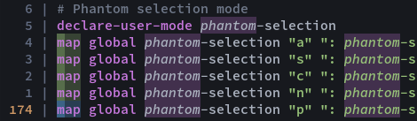

# one.kak

`One Light` and `One Dark` colorschemes for [Kakoune](https://kakoune.org). Based on [vim-one](https://github.com/rakr/vim-one).

Includes an additional `One Darker` colorscheme, which is a personalized flavor of `One Dark` with readability improvements and some syntax changes.

## Installation

With [plug.kak](https://github.com/andreyorst/plug.kak):

```
plug "raiguard/one.kak" theme
```

You can also manually put the colorscheme file(s) in your `.config/kak/colors` directory.

Provided are `one-light`, `one-dark`, and `one-darker` colorschemes.

For kak-lsp features to work properly, specify the colorscheme as the _last_ thing in your `kakrc`.

## Plugin support

`one.kak` includes colors for the following plugins:

- [kak-lsp](https://github.com/kak-lsp/kak-lsp)
    - Parameters are italicized (`parameter` face)
    - Inlay hints are colored as comments
    - Enums are cyan (`enum` face)
    - Errors and warnings are highlighted red and orange, respectively
    - Other references to the current symbol are bolded and underlined
- [kakoune-phantom-selection](https://github.com/occivink/kakoune-phantom-selection)
    - Phantom selections are highlighted magenta and italicized

## Scheme screenshots

### One Light


### One Dark


### One Darker


Changes in `One Darker` over `One Dark` are:

- Darker background color
- Variables are white instead of red
- Operators are red instead of white
- Comments are more visible

## Feature screenshots

### Alpha-blended selections


### Secondary and phantom selections



### kak-lsp diagnostics


