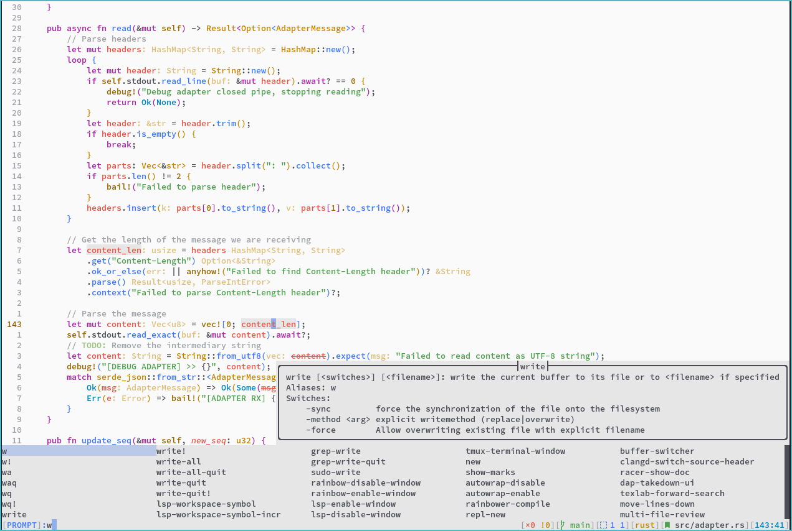
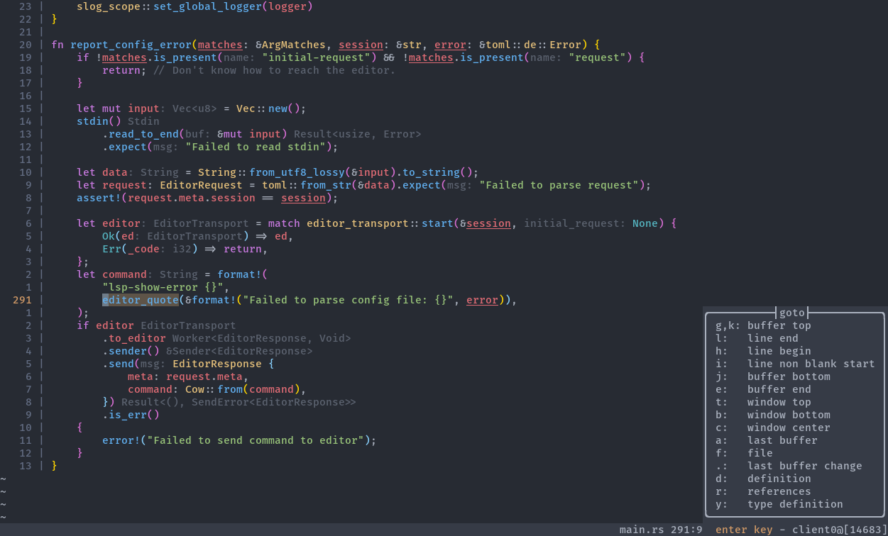
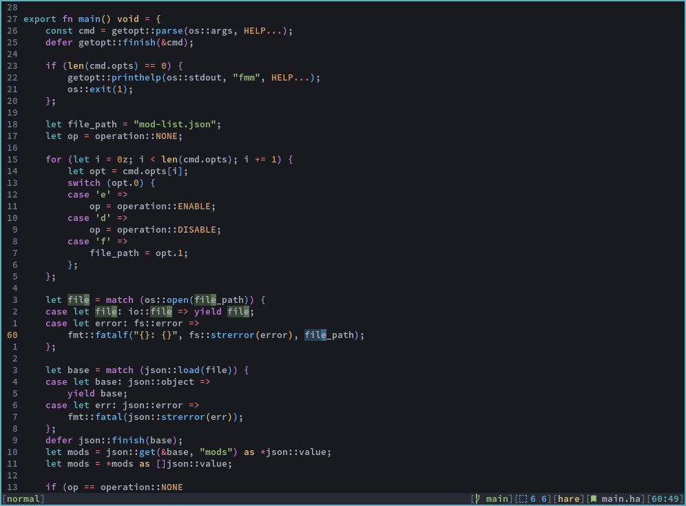
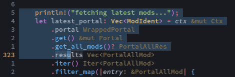
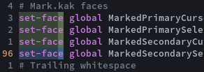
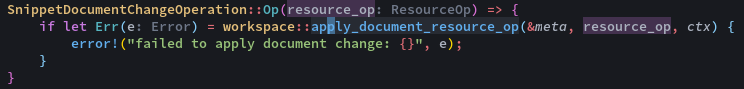
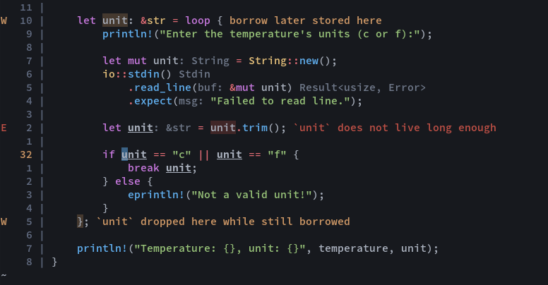

# one.kak

`One Light` and `One Dark` colorschemes for [Kakoune](https://kakoune.org). Based on [vim-one](https://github.com/rakr/vim-one).

Includes an additional `One Darker` colorscheme, which is a personalized flavor of `One Dark` with readability improvements and some syntax changes.

Includes optional faces for colored curly underlines. This features requires building kakoune manually, as there is not yet an official release supporting this feature. This feature may not work on all terminal emulators.

## Installation

With [plug.kak](https://github.com/andreyorst/plug.kak):

```
plug "raiguard/one.kak" theme
```

You can also manually put the colorscheme file(s) in your `.config/kak/colors` directory.

Provided are `one-light`, `one-dark`, and `one-darker` colorschemes.

## Plugin support

`one.kak` includes colors for the following plugins:

- [kak-lsp](https://github.com/kak-lsp/kak-lsp)
    - Inlay hints are colored as comments
    - Errors and warnings are underlines in red and orange, respectively (if the terminal emulator supports it, see [kak-lsp diagnostics](kak-lsp diagnostics))
    - Other references to the current symbol are highlighted in a slightly lighter background color
- [kakoune-phantom-selection](https://github.com/occivink/kakoune-phantom-selection)
    - Phantom selections are highlighted magenta and italicized

## Scheme screenshots

These screenshots include a number of custom semantic highlighting settings, see [my kak-lsp.toml](https://github.com/raiguard/dotfiles/blob/master/.config/kak-lsp/kak-lsp.toml).

These screenshots also include the [kak-rainbower](https://github.com/crizan/kak-rainbower) plugin.

### One Light



### One Dark



### One Darker



Changes in `One Darker` over `One Dark` are:

- Darker background color
- Variables are white instead of red
- Operators are red instead of white
- Comments are more visible

## Feature screenshots

### Alpha-blended selections



### Obvious secondary selections



### [Phantom selections](https://github.com/raiguard/phantom.kak)



### kak-lsp diagnostics



To enable curly underlines, invoke the `one-enable-curly-underlines` command after enabling the colorscheme. Please note that this will not work on all terminal emulators.
