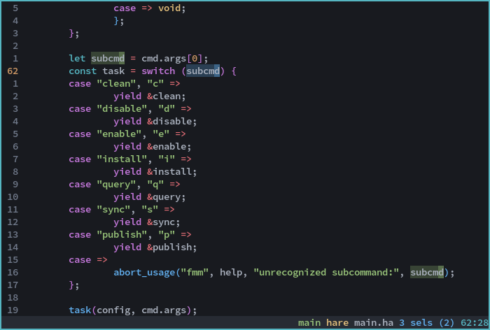
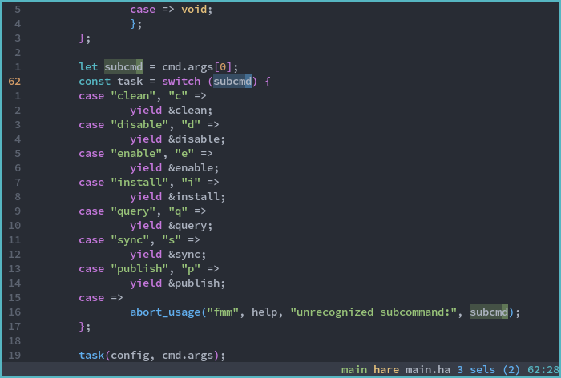

# kak-one





`One Light` and `One Dark` colorschemes for [Kakoune](https://kakoune.org).
Based on [vim-one](https://github.com/rakr/vim-one).
Includes an additional `One Darker` colorscheme, which has higher contrast than
`One Dark` and the coloring of variables and operators is swapped.

## Installation

Install the files in the `colors` subdirectory in `(kak configuration)/colors`,
or use a plugin manager.

## Usage

Enable one of the themes with `colorscheme <name>`:
- `one-light`, `one-light-16`
- `one-dark`, `one-dark-16`
- `one-darker`, `one-darker-16`

## 16-color variants

There is a 16-color variant of each theme available that uses your base
terminal colors. To achieve the correct theme, you will need to set your
terminal colors accordingly.

Color option expansions (explained below) are not available in 16-color
variants - use the ANSI color names instead.

`one-light-16`, `one-dark-16`, `one-darker-16`

### [Foot](https://codeberg.org/dnkl/foot) color configuration for `one-darker-16`

```ini
[colors]
foreground=abb2bf # white
background=181a1f # black
selection-foreground=181a1f # black
selection-background=61afef # blue
regular0=282c34 # black
regular1=e06c75 # red
regular2=98c379 # green
regular3=e5c07b # yellow
regular4=61afef # blue
regular5=c678dd # magenta
regular6=56b6c2 # cyan
regular7=abb2bf # white
bright0=70798a # bright black
bright1=e06c75 # bright red
bright2=98c379 # bright green
bright3=d19a66 # bright yellow
bright4=61afef # bright blue
bright5=c678dd # bright magenta
bright6=56b6c2 # bright cyan
bright7=ffffff # bright white
dim1=7c434a # dim red
dim2=586e4c # dim green
dim3=7e6d4d # dim yellow
dim4=3c6487 # dim blue
dim5=6f497e # dim magenta
dim6=376870 # dim cyan
dim7=70798a # dim white (comment color)
```

## Plugin support

`kak-one` includes colors for the following plugins:

- [kak-lsp](https://github.com/kak-lsp/kak-lsp)
    - LSP info boxes are syntax highlighted
    - Inlay hints inherit from the `type` face, with a dim modifier
    - Special `enum` and `parameter` faces are provided for semantic highlighting (requires configuration in `kak-lsp.toml`)
        - `enum` is cyan
        - `parameter` is italicized and uses the `variable` color
    - LSP diagnostics are colored as:
        - Error: red
        - Warning: yellow
        - Info: blue
        - Hint: bright white / dark black (in dark and light themes respectively)
    - Inline diagnostics are represented with colored curly underlines - this feature may not work on all terminal emulators
    - Other references to the current symbol are highlighted in a slightly lighter background color
- [kak-rainbower](https://github.com/crizan/kak-rainbower)
    - Brackets are colored yellow, magenta, and blue

## Using scheme constructs in your own scripts

You can use the scheme colors and other properties in your own scripts by using the following options in expansions:

```kak
add-highlighter global/trailing-whitespaces regex "(\h+)$" "1:default,rgba:%opt{darkred}%opt{selectionalpha}"
```

### Colors

- `fg`
- `bg`
- `subbg`

- `lightred`
- `darkred`
- `green`
- `lightorange`
- `darkorange`
- `blue`
- `magenta`
- `cyan`

- `comment`

### Transparencies

- `cursoralpha`
- `selectionalpha`

### Other

- `menuselection` (cursor color adjusted for ths `subbg` background, since menus do not support transparency)

## Feature screenshots

### Alpha-blended selections


### Obvious secondary selections


### kak-lsp diagnostics


Curly and/or colored underlines may not display on all terminal emulators.
