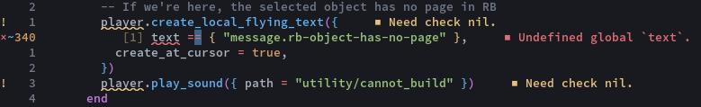

# one.kak

`One Light` and `One Dark` colorschemes for [Kakoune](https://kakoune.org). Based on [vim-one](https://github.com/rakr/vim-one).

Includes an additional `One Darker` colorscheme, which is a personalized flavor of `One Dark` with readability improvements and some syntax changes.

Includes optional faces for colored curly underlines. This features requires Kakoune 2021.10.28 or newer. This feature may not work on all terminal emulators.

## Installation

With [plug.kak](https://github.com/andreyorst/plug.kak):

```kakounescript
plug "raiguard/one.kak" theme
```

You can also manually put the colorscheme file(s) in your `.config/kak/colors` directory.

## Usage

Enable the desired colorscheme using the `colorscheme` command in your `kakrc`:

```kakounescript
colorscheme one-darker
# Requires kakoune 2021.10.28 or newer, and a compatible terminal emulator:
one-enable-fancy-underlines
```

Provided are `one-light`, `one-dark`, and `one-darker` colorschemes.

## Plugin support

`one.kak` includes colors for the following plugins:

- [kak-lsp](https://github.com/kak-lsp/kak-lsp)
    - LSP info boxes are syntax highlighted
    - Inlay hints are colored as comments
    - Special `enum` and `parameter` faces are provided for semantic highlighting (requires configuration in `kak-lsp.toml`)
        - `enum` is cyan
        - `parameter` is italicized
    - Diagnostics are underlined, inlay diagnostics and diagnostic line flags are colored as thus:
        - Error: red
        - Warning: yellow
        - Info: blue
        - Hint: grey
    - If `one-enable-fancy-underlines` are enabled, diagnostics are underlined in their respective colors using curly underlines
    - Other references to the current symbol are highlighted in a slightly lighter background color
- [kak-rainbower](https://github.com/crizan/kak-rainbower)
    - Brackets are colored gold, magenta, and light blue
    - `one-light` has darker variations of these colors to improve visibility

## Using scheme constructs in your own scripts

You can use the scheme colors and other properties in your own scripts by using the following options in expansions:

```kakounescript
addhl global/trailing-whitespaces regex "(\h+)$" "1:default,rgba:%opt{darkred}%opt{selectionalpha}"
```

### Colors

- `fg`
- `bg`
- `subbg`

- `lightred`
- `darkred`
- `green`
- `lightorange`
- `darkorange`
- `blue`
- `magenta`
- `cyan`

- `gutter`
- `comment`

### Transparencies

- `cursoralpha`
- `selectionalpha`

### Other

- `menuselection` (cursor color adjusted for ths `subbg` background, since menus do not support transparency)

## Scheme screenshots

These screenshots include a number of custom semantic highlighting settings, see [my kak-lsp.toml](https://github.com/raiguard/dotfiles/blob/master/.config/kak-lsp/kak-lsp.toml).

These screenshots also include the [kak-rainbower](https://github.com/crizan/kak-rainbower) plugin.

### One Light


### One Dark


### One Darker


Changes in `One Darker` over `One Dark` are:

- Darker background color
- Variables are white instead of red
- Operators are red instead of white
- Comments are more visible

## Feature screenshots

### Alpha-blended selections


### Obvious secondary selections


### kak-lsp diagnostics



To enable curly underlines, invoke the `one-enable-fancy-underlines` command after enabling the colorscheme. Please note that this will not work on all terminal emulators.
