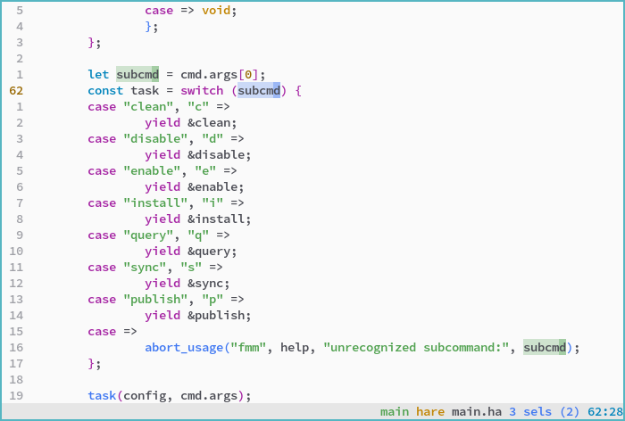

# one.kak

`One Light` and `One Dark` colorschemes for [Kakoune](https://kakoune.org). Based on [vim-one](https://github.com/rakr/vim-one).

Includes an additional `One Darker` colorscheme, which is a personalized flavor of `One Dark` with readability improvements and some syntax changes.

## Plugin support

`one.kak` includes colors for the following plugins:

- [kak-lsp](https://github.com/kak-lsp/kak-lsp)
- [kakoune-phantom-selection](https://github.com/occivink/kakoune-phantom-selection)

## Screenshots

### One Light

### One Dark

### One Darker

Changes in `One Darker` over `One Dark` are:

- Darker background color
- Variables are white instead of red
- Operators are red instead of white
- Comments are more visible
- Semantic parameters are a unique orange color instead of being underlined
